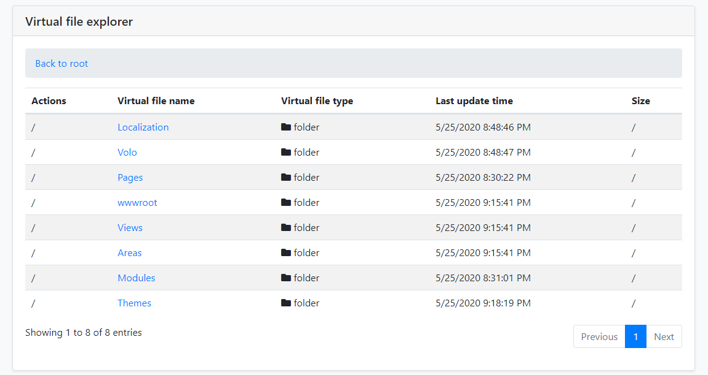

# 虚拟文件浏览器模块

## 什么是虚拟文件浏览器模块

虚拟文件浏览器模块提供了一个简单的UI来查看[虚拟文件系统](../Virtual-File-System.md)所有的文件.

> [启动模板](../Startup-Templates/Index.md)默认并没有安装这个模块,所以你需要手动安装到应用程序.

### 安装

#### 1- 引用虚拟文件浏览器模块包

建议使用ABP CLI安装模块,在解决方案文件 (`.sln`) 目录打开 `CMD` 窗口,运行以下命令:

`abp add-module Volo.VirtualFileExplorer`

或者你也可以手动安装nuget包到 `Acme.MyProject.Web` 项目:

* 安装[Volo.Abp.VirtualFileExplorer.Web](https://www.nuget.org/packages/Volo.Abp.VirtualFileExplorer.Web/) nuget包到 `Acme.MyProject.Web` 项目.

  `Install-Package Volo.Abp.VirtualFileExplorer.Web`

#### 2- 添加模块依赖

* 打开 `MyProjectWebModule.cs` 并且添加 `typeof(AbpVirtualFileExplorerWebModule)` 如下所示;

  ```csharp
     [DependsOn(
          typeof(AbpVirtualFileExplorerWebModule),
          typeof(MyProjectApplicationModule),
          typeof(MyProjectEntityFrameworkCoreModule),
          typeof(AbpAutofacModule),
          typeof(AbpIdentityWebModule),
          typeof(AbpAccountWebModule),
          typeof(AbpAspNetCoreMvcUiBasicThemeModule)
      )]
      public class MyProjectWebModule : AbpModule
      {
          //...
      }
  ```

#### 3- 添加NPM包

 * 打开 `package.json` 添加 `@abp/virtual-file-explorer": "^2.9.0` 如下所示:
  
  ```json
    {
        "version": "1.0.0",
        "name": "my-app",
        "private": true,
        "dependencies": {
            "@abp/aspnetcore.mvc.ui.theme.basic": "^2.9.0",
            "@abp/virtual-file-explorer": "^2.9.0"
        }
    }
  ```

  然后在 `Acme.MyProject.Web` 项目目录打开命令行终端运行以下命令:

  1. `yarn`
  2. `gulp`

这就是全部,运行应用程序导航到 `/VirtualFileExplorer`. 你会看到虚拟文件浏览器页面:



### 选项

你可以通过 `AbpVirtualFileExplorerOptions` 选项禁用虚拟文件浏览器模块:

```csharp
public override void PreConfigureServices(ServiceConfigurationContext context)
{
    PreConfigure<AbpVirtualFileExplorerOptions>(options =>
    {
        options.IsEnabled = false;
    });
}
```